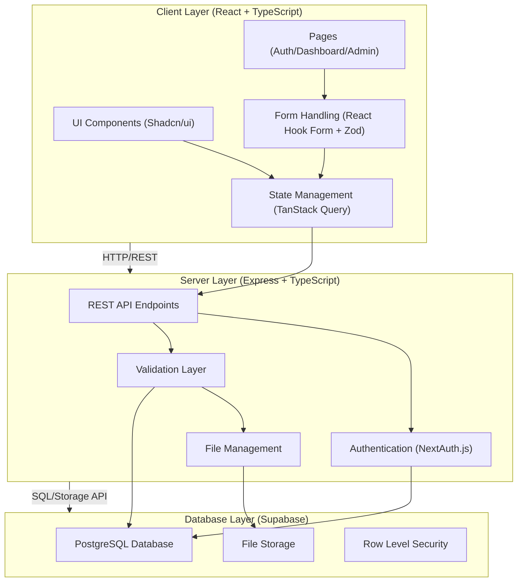
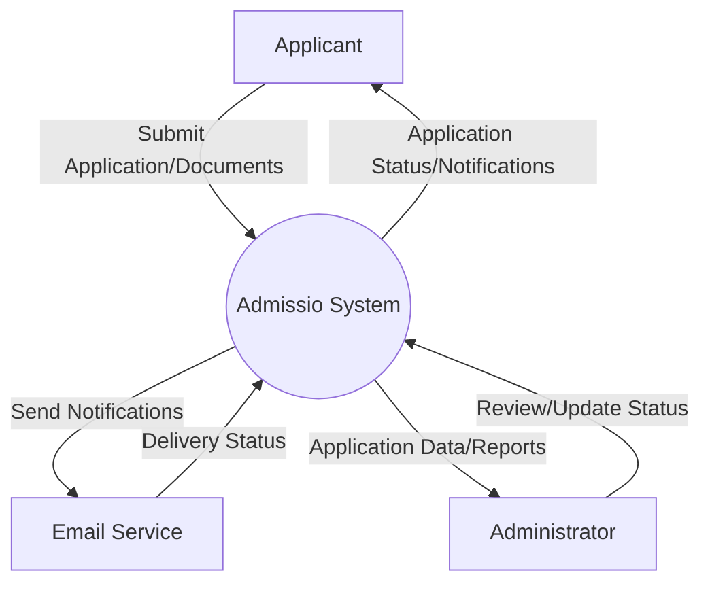
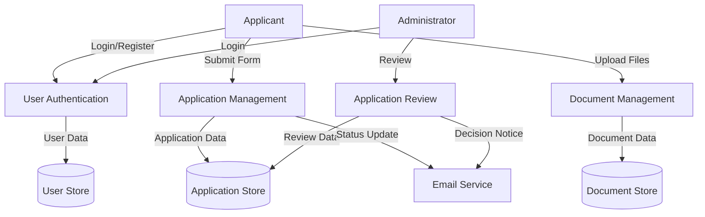
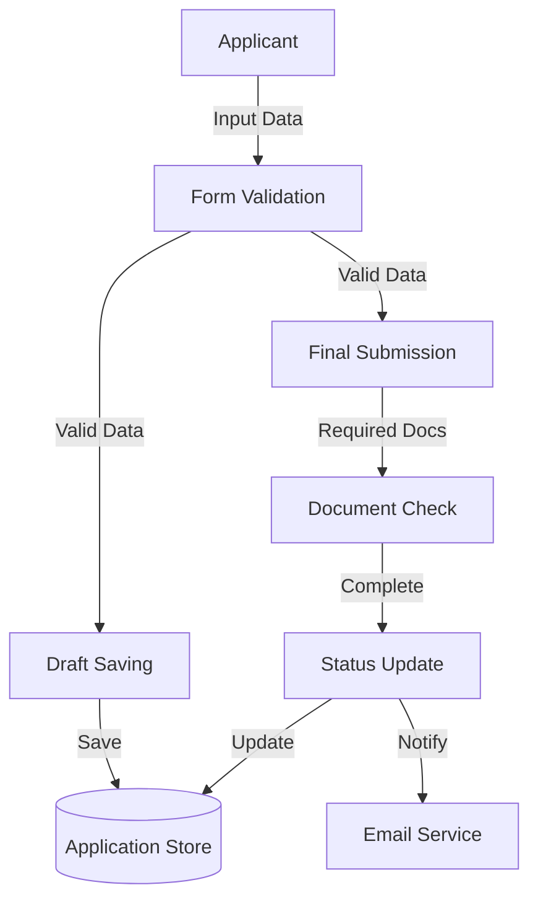
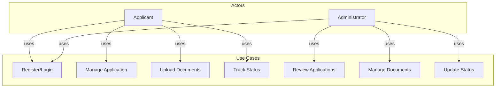
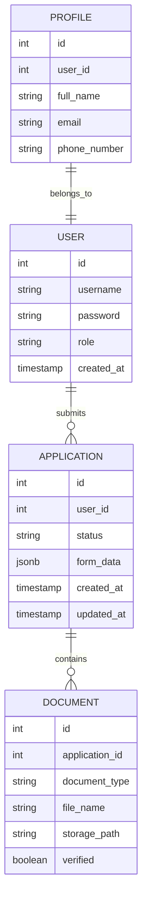
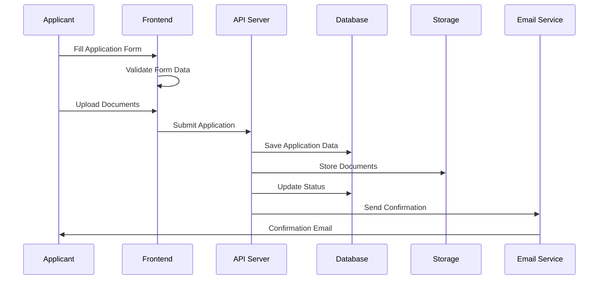
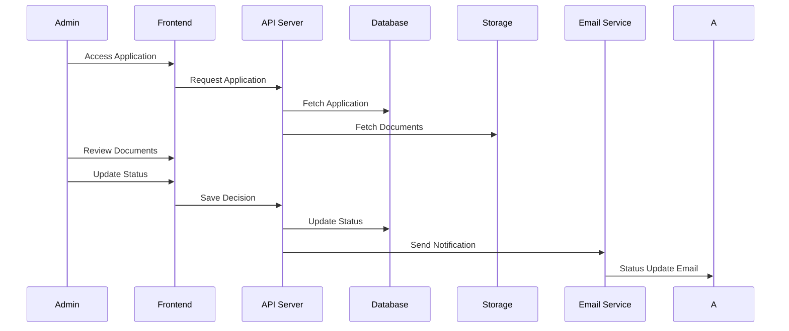

# System Diagrams

## System Architecture

## 4.6.1 Data Flow Diagrams (DFDs)

### Level 0 DFD (Context Diagram)

### Level 1 DFD

### Level 2 DFD: Application Management

## 4.6.2 Use Case Diagram

## 4.6.3 Entity-Relationship Diagram

## 4.6.4 Sequence Diagrams

### Application Submission Sequence

### Application Review Sequence

